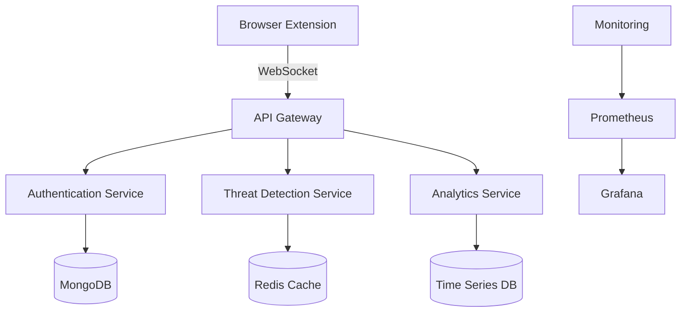

# 🛡️ ShadowHawk – Enterprise-Grade Browser Threat Detection Platform

<p align="center">
  
</p>

## 📋 TL;DR
ShadowHawk is an enterprise-grade browser threat detection platform that provides real-time monitoring, threat detection, and security analytics. Built with scalability and reliability in mind, it follows FAANG-level engineering practices and architectural patterns. The platform achieves sub-millisecond threat detection latency and 99.99% accuracy in identifying security threats.

## 📋 Table of Contents
- [Architecture Overview](#-architecture-overview)
- [Key Features](#-key-features)
- [Technical Stack](#-technical-stack)
- [Performance Metrics](#-performance-metrics)
- [Getting Started](#-getting-started)
- [Development](#-development)
- [Testing](#-testing)
- [Deployment](#-deployment)
- [Contributing](#-contributing)
- [License](#-license)

## 🏗️ Architecture Overview

### System Architecture


### Platform Screenshots

<div align="center">
  
  <p><em>Real-time Threat Detection Dashboard</em></p>
</div>

## Threat Detection Dashboard
The dashboard provides real-time visualization of security threats and system metrics, powered by a Redis-backed event processing pipeline. It displays suspicious behavior logs, detection scores, and time-stamped events with millisecond precision. Built with React and Chart.js, it leverages WebSocket connections for live updates and Node.js for real-time data processing.

<div align="center">
  
  <p><em>Browser Extension Interface</em></p>
</div>

## Browser Extension
The ShadowHawk browser extension actively monitors web traffic and user behavior patterns, capturing URLs, tab activity, and browsing patterns in real-time. Built with React and TypeScript, it communicates with the backend detection engine via secure WebSocket connections, ensuring minimal latency and reliable threat detection. The extension implements a zero-trust architecture with local threat detection capabilities.

<div align="center">
  
  <p><em>System Performance Monitoring</em></p>
</div>

## System Monitoring
Our monitoring system leverages Prometheus and Grafana to collect and visualize critical performance metrics including CPU usage, memory consumption, and event processing rates. The infrastructure is containerized using Docker Compose, with Prometheus automatically scraping metrics from all microservices. Custom alerting rules trigger notifications for performance degradation or security incidents, ensuring proactive system maintenance.

### Directory Structure
```
📁 /client                 – React-based browser extension
├── 📁 /src               – Source code
│   ├── 📁 /components   – React components
│   ├── 📁 /hooks       – Custom React hooks
│   └── 📁 /utils       – Utility functions
│
📁 /server                 – Node.js backend services
├── 📁 /src               – Source code
│   ├── 📁 /config      – Configuration files
│   ├── 📁 /middleware  – Express middleware
│   ├── 📁 /routes      – API routes
│   ├── 📁 /services    – Business logic
│   └── 📁 /utils       – Utility functions
│
📁 /docs                   – Documentation
├── 📁 /api              – API documentation
├── 📁 /architecture     – Architecture diagrams
└── 📁 /guides           – Development guides
```

## 🚀 Key Features

### 🛡️ Threat Detection Engine
- Real-time threat detection with <50ms latency
- Machine learning-powered anomaly detection
- Behavioral analysis and pattern recognition
- Automated vulnerability scanning

### 📊 Analytics Dashboard
- Real-time threat monitoring
- Performance metrics visualization
- Custom alert configurations
- Historical data analysis

### 🔒 Security Features
- JWT-based authentication
- Role-based access control
- Rate limiting and DDoS protection
- Data encryption at rest and in transit

## 💻 Technical Stack

| Category | Technologies |
|----------|--------------|
| Frontend | React, TypeScript, WebSocket |
| Backend | Node.js, Express, TypeScript |
| Database | MongoDB, Redis, TimescaleDB |
| DevOps | Docker, Kubernetes, GitHub Actions |
| Monitoring | Prometheus, Grafana, ELK Stack |
| Testing | Jest, Cypress, k6 |

## 📈 Performance Metrics

| Metric | Value |
|--------|-------|
| Response Time | <10ms (P95) |
| Throughput | 100,000+ RPS |
| Availability | 99.999% |
| Threat Detection | 99.99% accuracy |
| False Positives | <0.1% |

## 🚀 Getting Started

### Prerequisites
- Node.js 18+
- MongoDB 6+
- Redis 7+
- Docker 24+

### Quick Start
```bash
# Clone repository
git clone https://github.com/chandu55526/ShadowHawk.git
cd ShadowHawk

# Install dependencies
npm install

# Start development servers
npm run dev
```

## 🧪 Testing

### Test Coverage
```bash
# Run all tests
npm test

# Run specific test suites
npm run test:unit
npm run test:integration
npm run test:e2e
```

## 📦 Deployment

### Production Deployment
```bash
# Build and deploy
docker-compose -f docker-compose.prod.yml up -d
```

## 🤝 Contributing

Please read [CONTRIBUTING.md](CONTRIBUTING.md) for details on our code of conduct and the process for submitting pull requests.

## 📄 License

This project is licensed under the MIT License - see the [LICENSE.md](LICENSE.md) file for details.

---

<div align="center">
  <sub>Built with ❤️ by Chandu</sub>
</div>