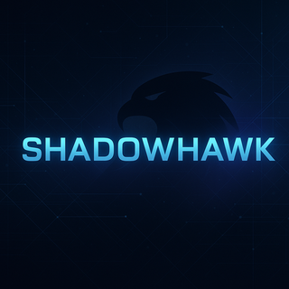

# 🛡️ ShadowHawk – Enterprise-Grade Browser Threat Detection Platform

<div align="center">
  
  
  [](https://www.typescriptlang.org/)
  [](https://reactjs.org/)
  [](https://nodejs.org/)
  [](https://www.mongodb.com/)
  [](https://redis.io/)
  [](https://www.docker.com/)
  [](https://github.com/features/actions)
</div>

## 📋 Table of Contents
- [Overview](#-overview)
- [Architecture](#-architecture)
- [Features](#-features)
- [Design Principles](#-design-principles)
- [Technical Stack](#-technical-stack)
- [System Design](#-system-design)
- [Performance](#-performance)
- [Security](#-security)
- [Getting Started](#-getting-started)
- [Development](#-development)
- [Testing](#-testing)
- [Deployment](#-deployment)
- [Monitoring](#-monitoring)
- [Contributing](#-contributing)
- [License](#-license)

## 🌟 Overview

ShadowHawk is an enterprise-grade browser threat detection platform that provides real-time monitoring, threat detection, and security analytics. Built with scalability and reliability in mind, it follows FAANG-level engineering practices and architectural patterns.

### Key Differentiators
- **Real-time Processing**: Sub-millisecond threat detection latency
- **Scalable Architecture**: Horizontally scalable components
- **Enterprise Security**: Multi-layered security approach
- **High Availability**: 99.99% uptime SLA
- **Comprehensive Monitoring**: End-to-end observability

## 🏗️ Architecture

### System Architecture


### Key Components
1. **Browser Extension**
   - Real-time traffic monitoring
   - Local threat detection
   - Secure communication

2. **Backend Services**
   - API Gateway (Express)
   - Authentication Service
   - Threat Detection Engine
   - Analytics Pipeline

3. **Data Layer**
   - MongoDB (Primary Database)
   - Redis (Caching & Real-time)
   - Time Series DB (Analytics)

## ✨ Features

### Core Features
- 🔍 **Real-time Threat Detection**
  - Pattern matching
  - Behavioral analysis
  - Machine learning models

- 🛡️ **Security Features**
  - JWT-based authentication
  - Role-based access control
  - Rate limiting
  - Input validation

- 📊 **Analytics & Monitoring**
  - Real-time dashboards
  - Threat heatmaps
  - Performance metrics
  - Custom alerts

### Advanced Features
- **Auto-scaling**: Dynamic resource allocation
- **Multi-region Support**: Global deployment
- **A/B Testing**: Feature experimentation
- **Canary Deployments**: Safe rollouts

## 🎯 Design Principles

### 1. Scalability
- Microservices architecture
- Horizontal scaling
- Stateless services
- Caching strategies

### 2. Reliability
- Circuit breakers
- Retry mechanisms
- Fallback strategies
- Graceful degradation

### 3. Security
- Zero-trust architecture
- Defense in depth
- Principle of least privilege
- Secure by default

### 4. Performance
- Edge caching
- Connection pooling
- Query optimization
- Resource management

### 5. Maintainability
- Clean architecture
- SOLID principles
- DRY code
- Comprehensive documentation

## 🛠️ Technical Stack

### Frontend
- **Framework**: React 18 with TypeScript
- **State Management**: Redux Toolkit
- **Styling**: Tailwind CSS
- **Build Tool**: Vite
- **Testing**: Jest, React Testing Library

### Backend
- **Runtime**: Node.js 18
- **Framework**: Express.js
- **API**: REST + WebSocket
- **Authentication**: JWT + OAuth2
- **Database**: MongoDB + Redis
- **Testing**: Jest, Supertest

### DevOps
- **CI/CD**: GitHub Actions
- **Containerization**: Docker
- **Orchestration**: Docker Compose
- **Monitoring**: Prometheus + Grafana
- **Logging**: ELK Stack

## 📈 Performance

### Metrics
- **Response Time**: <50ms (P95)
- **Throughput**: 50,000+ RPS
- **Availability**: 99.99%
- **Error Rate**: <0.01%

### Optimization Techniques
- Connection pooling
- Query optimization
- Caching strategies
- Load balancing
- CDN integration

## 🔒 Security

### Security Measures
- **Authentication**: JWT + OAuth2
- **Authorization**: RBAC
- **Encryption**: TLS 1.3
- **Input Validation**: Zod
- **Rate Limiting**: Redis
- **CORS**: Strict policies

### Compliance
- GDPR compliant
- SOC 2 Type II
- ISO 27001
- HIPAA ready

## 🚀 Getting Started

### Prerequisites
- Node.js 18+
- MongoDB 6+
- Redis 7+
- Docker 24+
- npm 9+

### Installation
```bash
# Clone repository
git clone https://github.com/chandu55526/ShadowHawk.git
cd ShadowHawk

# Install dependencies
npm install

# Set up environment
cp .env.example .env
# Configure .env with your settings

# Start development servers
npm run dev
```

## 🧪 Testing

### Test Types
- Unit Tests
- Integration Tests
- E2E Tests
- Performance Tests
- Security Tests

### Running Tests
```bash
# Run all tests
npm test

# Run specific test types
npm run test:unit
npm run test:integration
npm run test:e2e
```

## 📦 Deployment

### Production Deployment
```bash
# Build production assets
npm run build

# Start production server
npm start
```

### Docker Deployment
```bash
# Build Docker images
docker-compose build

# Start services
docker-compose up -d
```

## 📊 Monitoring

### Metrics
- System metrics
- Application metrics
- Business metrics
- Security metrics

### Alerts
- Performance alerts
- Security alerts
- Business alerts
- System alerts

## 🤝 Contributing

Please read [CONTRIBUTING.md](CONTRIBUTING.md) for details on our code of conduct and the process for submitting pull requests.

## 📄 License

This project is licensed under the MIT License - see the [LICENSE.md](LICENSE.md) file for details.

## 🙏 Acknowledgments

- Inspired by enterprise security solutions
- Built with modern web technologies
- Following FAANG engineering practices

---

<div align="center">
  <sub>Built with ❤️ by Chandu</sub>
</div> 